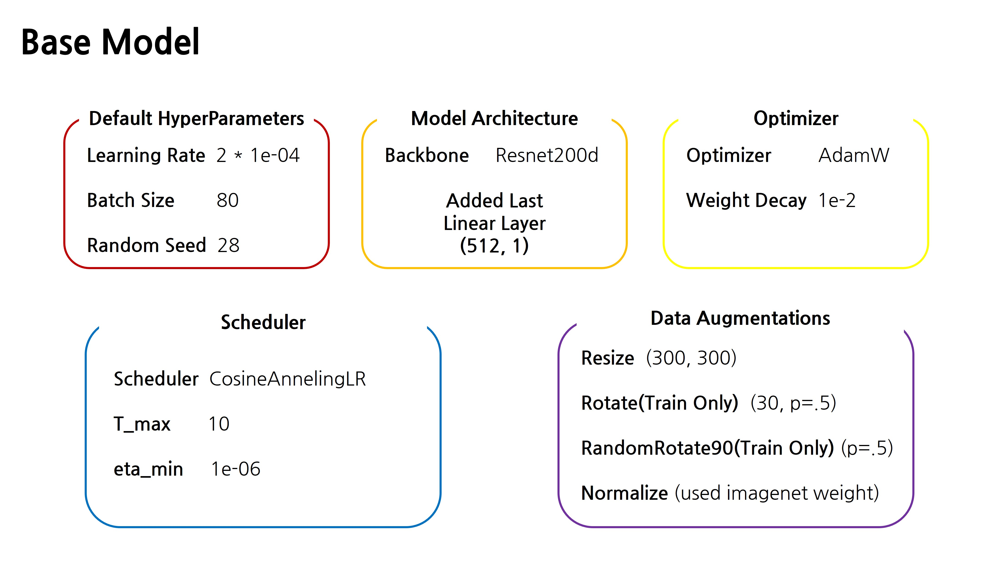
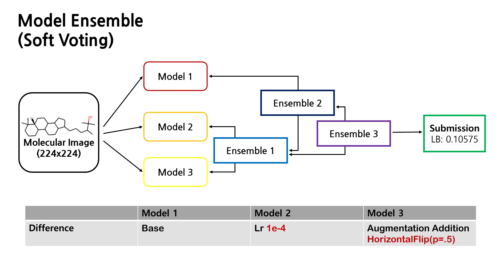

# Samsung-AI-Challenge

## Docker Image
```
docker pull wean1030/samsung-ai-challenge:init 
```
---

## Architecture
### 1. Base Model

### 2. Ensemble

---

## Languages and frameworks used
~~~
Python, Pytorch, Docker
~~~
---

## Techniques to try and apply to improve performance
~~~ 
1. Test Time Augmentation
2. SAM Optimizer (I tried it, but it doesn't perform well, and it takes a long time to train)
3. Small Batch Training
4. Data Augmentation
5. Soft Voting (Ensemble)
6. Seed Ensemble
7. ResNet, NfNet, VisionTransformer, EfficientNet
~~~
---

## Competition Link
https://dacon.io/competitions/official/235789/overview/description
